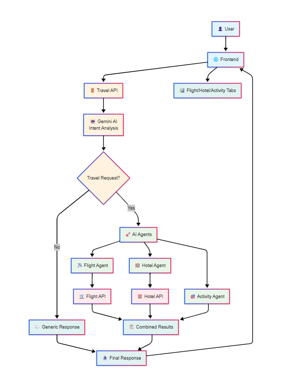

# Agentic Travel Search API

An intelligent travel search API that uses AI agents to automatically search flights, hotels, and activities based on user requests. Built with the Vercel AI SDK and Google Gemini 2.0 Flash, this system intelligently decides when to call travel search APIs versus providing generic responses.

## Features

- 🤖 **AI-Powered Intent Analysis** - Automatically determines if requests are travel-related
- ✈️ **Smart Flight Search** - Integrates with flight search APIs
- 🏨 **Hotel Search** - Finds and displays hotel options
- 🎯 **Activity Suggestions** - Generates popular tourist activities
- 🔧 **Multi-Step Tool Usage** - AI autonomously decides which services to call
- 📊 **Structured Responses** - Organized data for rich frontend displays
- 🛡️ **Type Safety** - Full Zod validation throughout the system

## Project Setup

### 1. Initialize Node.js Project

```bash
npm init -y
```

### 2. Create Project Structure

Create the following folders and files:

```
agentic_bot_api/
├── src/
│   └── index.ts
├── dist/
├── node_modules/
├── .env
├── .gitignore
├── package.json
├── package-lock.json
└── tsconfig.json
```

### 3. Install Dependencies

```bash
# Core dependencies
npm install @ai-sdk/google ai axios cors dotenv express zod

# Development dependencies
npm install -D @types/cors @types/express @types/node typescript tsx
```

### 4. Create TypeScript Configuration

Create `tsconfig.json`:

```json
{
  "compilerOptions": {
    "target": "ES2020",
    "module": "commonjs",
    "lib": ["ES2020"],
    "outDir": "./dist",
    "rootDir": "./src",
    "strict": true,
    "esModuleInterop": true,
    "skipLibCheck": true,
    "forceConsistentCasingInFileNames": true,
    "resolveJsonModule": true
  },
  "include": ["src/**/*"],
  "exclude": ["node_modules", "dist"]
}
```

### 5. Setup Environment Variables

Create `.env` file in the root directory:

```env
# Google AI API Key (required)
GOOGLE_GENERATIVE_AI_API_KEY=your_gemini_api_key_here

# External API URLs (configure based on your search services)
FLIGHT_API_URL=http://localhost:5000/searchflight
HOTEL_API_URL=http://localhost:5000/searchhotel

# Server Configuration
PORT=8000
```

### 6. Configure Package Scripts

Add to `package.json`:

```json
{
  "name": "travel-planning-api",
  "version": "1.0.0",
  "description": "Agentic travel planning API using Vercel AI SDK and Gemini 2.0 Flash",
  "main": "dist/index.js",
  "scripts": {
    "dev": "tsx watch src/index.ts",
    "build": "tsc",
    "start": "node dist/index.js",
    "test": "jest",
    "lint": "eslint src/**/*.ts",
    "lint:fix": "eslint src/**/*.ts --fix"
  },
  "keywords": [
    "ai",
    "travel",
    "booking",
    "gemini",
    "vercel-ai-sdk",
    "agents"
  ],
  "author": "Your Name",
  "license": "MIT",
  "dependencies": {
    "@ai-sdk/google": "^1.2.19",
    "ai": "^4.3.16",
    "axios": "^1.7.9",
    "cors": "^2.8.5",
    "dotenv": "^16.4.7",
    "express": "^4.21.2",
    "zod": "^3.24.1"
  },
  "devDependencies": {
    "@types/cors": "^2.8.17",
    "@types/express": "^5.0.0",
    "@types/node": "^22.10.2",
    "@typescript-eslint/eslint-plugin": "^8.18.2",
    "@typescript-eslint/parser": "^8.18.2",
    "eslint": "^9.18.0",
    "jest": "^29.7.0",
    "tsx": "^4.19.2",
    "typescript": "^5.7.2"
  },
  "engines": {
    "node": ">=18.0.0"
  }
}

```

### 7. Create .gitignore

```
node_modules/
dist/
.env
*.log
.DS_Store
```

### 8. Run the Project

```bash
# Development mode
npm run dev

# Production build
npm run build
npm start
```

## API Endpoints

- **POST `/chat`** - Main endpoint for travel search requests
- **GET `/health`** - Health check endpoint


## How It Works

1. **Intent Analysis**: AI analyzes user requests to determine if they're travel-related
2. **Smart Routing**: Generic questions get direct responses, travel requests trigger agents
3. **Agent Execution**: AI automatically calls appropriate tools (flights, hotels, activities)
4. **API Integration**: Connects with real search services to fetch live data
5. **Response Assembly**: Combines all results into structured format for frontend consumption

## Example Request/Response

**Request:**
```json
{
  "prompt": "Search flights from Mumbai to Delhi on Dec 15-20 for 2 people",
  "history": []
}
```

**Response:**
```json
{
  "success": true,
  "response": "Here are your flight options...",
  "metadata": {
    "agentResults": {
      "flights": [
        {
          "searchId": "FLAI22720241215",
          "flightName": "Air India",
          "price": 18000,
          "departureTime": "08:00 AM",
          "route": "Mumbai to Delhi"
        }
      ],
      "hotels": [...],
      "activities": [...]
    }
  }
}
```

## Search API Response Format

The system expects external search APIs to return data in this format:

**Flight Search API Response:**
```json
{
  "status": "success",
  "results": [
    {
      "searchId": "FL123456",
      "departureDate": "2024-12-15",
      "returnDate": "2024-12-20",
      "travelers": 2,
      "destination": "Delhi",
      "origin": "Mumbai",
      "flightName": "Air India",
      "price": 18000,
      "departureTime": "08:00 AM",
      "arrivalTime": "10:00 AM",
      "flightNumber": "AI227",
      "route": "Mumbai to Delhi"
    }
  ]
}
```

**Hotel Search API Response:**
```json
{
  "status": "success",
  "results": [
    {
      "searchId": "HT789012",
      "checkIn": "2024-12-15",
      "checkOut": "2024-12-20",
      "destination": "Delhi",
      "hotelName": "Taj Hotel",
      "ratePerNight": 12000
    }
  ]
}
```

## Technology Stack

- **Vercel AI SDK** - AI agent orchestration and tool usage
- **Google Gemini 2.0 Flash** - Large language model
- **Express.js** - Web framework
- **TypeScript** - Type safety
- **Zod** - Runtime validation
- **Axios** - HTTP client for API calls


### Key Components:

1. **Intent Analyzer**: Determines if request is travel-related and extracts travel details
2. **Travel Agents**: Specialized tools for flight search, hotel search, and activity generation
3. **API Integration**: Connects with external search services
4. **Global State Store**: Workaround for capturing tool results reliably
5. **Response Builder**: Assembles final structured response

## Getting Your API Keys

1. Visit [Google AI Studio](https://makersuite.google.com/app/apikey)
2. Create a new API key for Gemini
3. Add it to your `.env` file as `GOOGLE_GENERATIVE_AI_API_KEY`

## Search vs Booking

This system is designed for **search functionality**, not actual bookings. It helps users:
- Find flight options with pricing
- Discover hotel availability and rates  
- Get activity recommendations for destinations

The APIs return search results that can be used by frontend applications to display options to users for further action.

## Frontend Integration

The structured metadata response enables rich frontend features:
- **Tabbed displays** for flights, hotels, and activities
- **Real-time data** from actual search APIs
- **Error handling** with detailed feedback
- **Loading states** with agent execution tracking

This project demonstrates modern AI application architecture using autonomous agents that can make intelligent decisions about when and how to interact with external search services.


