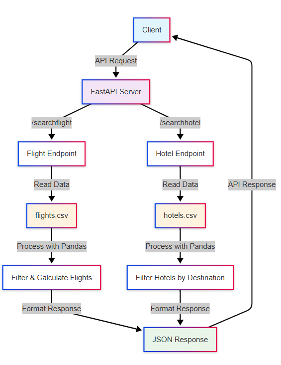

# Travel Booking API

A FastAPI-based travel booking system that provides flight and hotel booking services using real CSV data. The API allows users to search for flights between cities and hotels in specific destinations, with automatic price calculations based on the number of travelers.

## Project Setup

### 1. Create Project Structure

Create the following directory structure:

```
mock_flight_hotel_api/
├── __pycache__/
├── flights.csv
├── hotels.csv
├── main.py
└── requirements.txt
```

### 2. Create Required Files

**Create `main.py`** - Copy the FastAPI application code into this file.

**Create `requirements.txt`** - Add the following dependencies:
```
fastapi==0.104.1
uvicorn==0.24.0
pydantic==2.5.0
pandas==2.1.4
numpy==1.26.2
```

**Add CSV Data Files:**
- `flights.csv` - Contains flight data with columns: Flight Name, Fare (INR), Departure City, Arrival City, Departure Time, Flight Number
- `hotels.csv` - Contains hotel data with columns: Destination, Hotel Name, Rate Per Night (INR)

### 3. Installation & Running

**Install dependencies:**
```bash
pip install -r requirements.txt
```

**Run the application:**
```bash
python main.py
```

The API will be available at `http://localhost:5000`.

## API Endpoints

### Flight Search
**POST** `/searchflight`
- Search for flights between origin and destination
- Returns flights for both directions (outbound and return)
- Multiplies fare by number of travelers

### Hotel Search
**POST** `/searchhotel`
- Search for hotels in a specific destination
- Returns all available hotels with rates per night

### Utility Endpoints
- **GET** `/debug` - View sample loaded data for troubleshooting
- **GET** `/` - API information and status

## Features

- **Case-insensitive search** - Works with any case combination (delhi, Delhi, DELHI)
- **Real CSV data integration** - Uses actual flight and hotel data from CSV files
- **Automatic price calculation** - Multiplies individual fares by number of travelers
- **Bidirectional flight search** - Shows flights for both travel directions
- **Robust data processing** - Uses pandas for reliable CSV handling
- **No booking IDs** - Clean response format without unnecessary booking references

## Data Format

**Flight Data:** Each flight includes name, fare, cities, departure time, and flight number.

**Hotel Data:** Each hotel includes destination, name, and nightly rate. The CSV uses grouped format where destination appears only on the first row of each city group.


